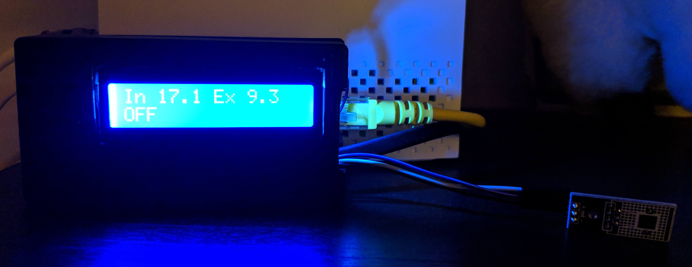
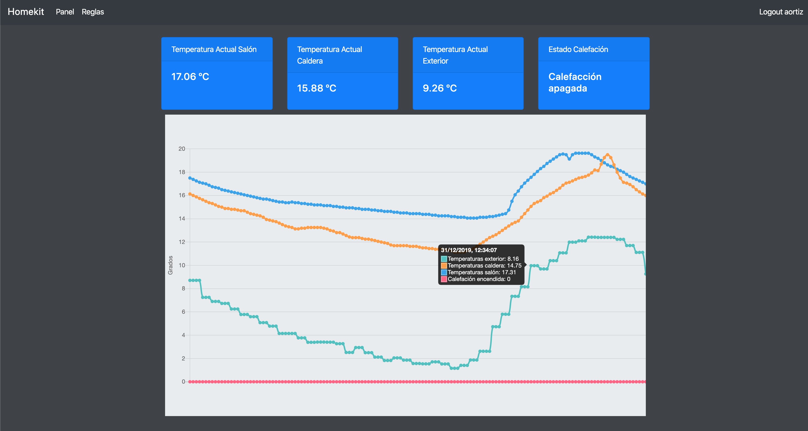
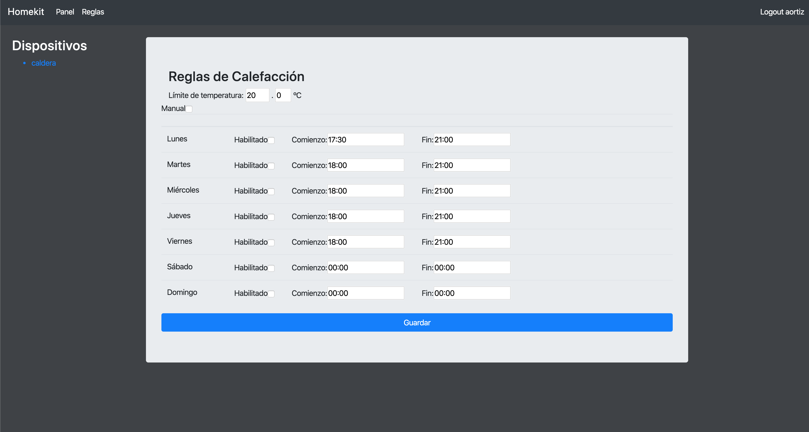

# Homekit

The purpose of this project is to create a smart thermostat that controls the temperature of a house based on certain rules according to the day, time and threshold temperature.
It also allows to know the record of temperatures registered during a configured time.
It has a web dashboard to know the status of the system and program its behaviour and an LCD screen to know the status of the system.
Users are notified by mail about fails, changes of state, etc..
Communication between devices is via wifi ethernet using mDNS(multicast dns) and DNS-SD (dns service discovery), so address configuration is not needed.

the system consists of two subsystems:

**Main controller**

  - Orange Pi Zero
  - I2C LCD Display (PCF8574)
  - 1Wire Temperature Sensor (DS18B20)

This system is in charge of diagnosis, logic of activation/deactivation of controller devices and human interface through web pages and LCD display.
The activation/deactivation of controller devices will be regarding the rules configured by the users and the temperature read from the temperature sensor.
Revel framework is used for the web application, using session authentication and websockets for dynamic information.

Web app:

**Device controller**

  - ESP8266 Node MCU
  - Relay Module
  - 1Wire Temperature Sensor (DS18B20)

Is in charge of receive commands of activation/deactivation of the relay module output and inform about the temperature read by the sensor.